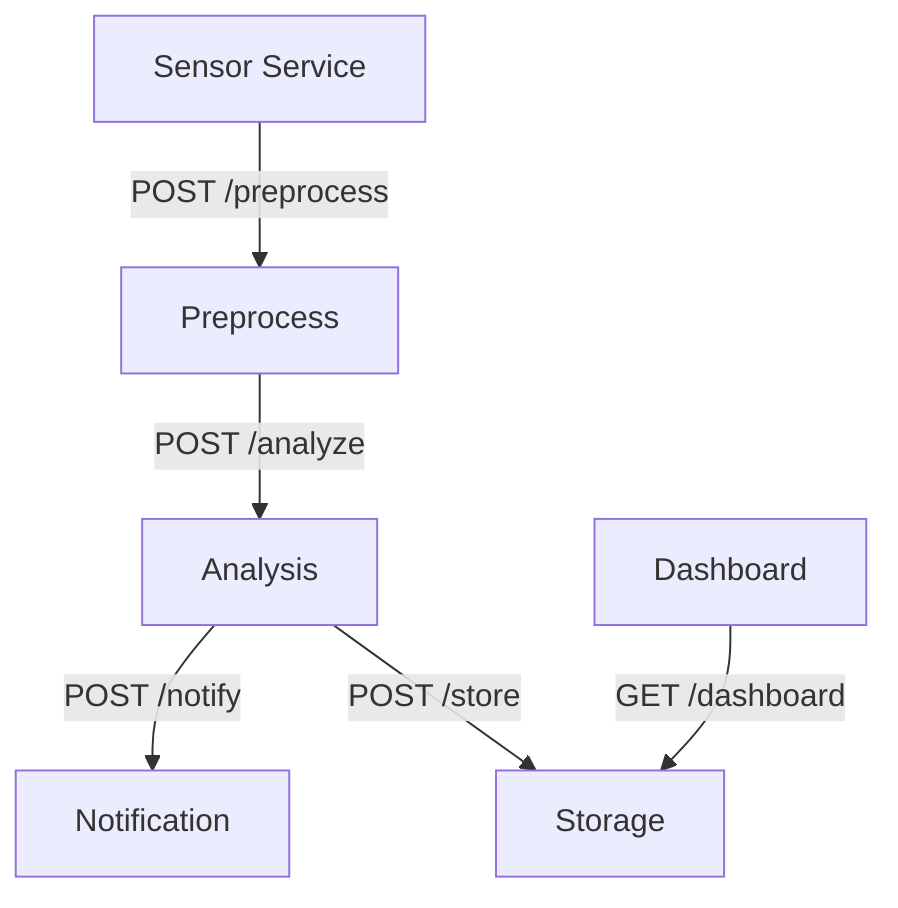

# 🩺 Real-Time Health Monitoring System using Service-Oriented Architecture (SOA)


A modular health monitoring platform that simulates real-time health data from wearables and processes it using independent microservices. It alerts caregivers and stores data securely.

---

## 📦 Architecture Overview

Each service is built as an independent FastAPI microservice and communicates via RESTful APIs.



---

## 🧰 Technologies

- Python 3.8+
- FastAPI
- SQLite (lightweight DB)
- RESTful APIs (can upgrade to Kafka/RabbitMQ)
- Async/Await support for real-time data

---

## 📂 Folder Structure

```
health-monitoring-soa/
│
├── sensor_service/         # Simulates wearable sensors
├── preprocess_service/     # Validates incoming data
├── analysis_service/       # Detects anomalies
├── notification_service/   # Triggers alerts
├── storage_service/        # Persists records in SQLite
├── dashboard_service/      # Shows patient vitals
├── requirements.txt
└── README.md
```

---

## 🛠️ Setup Instructions

### Install Dependencies

```bash
pip install -r requirements.txt
```

### Run Services

Each service runs on a different port. Use 6 terminal windows:

```bash
uvicorn main:app --reload --port 8000  # Sensor
uvicorn main:app --reload --port 8001  # Preprocess
uvicorn main:app --reload --port 8002  # Analysis
uvicorn main:app --reload --port 8003  # Notification
uvicorn main:app --reload --port 8005  # Storage
uvicorn main:app --reload --port 8006  # Dashboard
```

### View Dashboard

Open:
```
http://localhost:8006/dashboard/P123
```

---

## 🔮 Future Enhancements

- Kafka for event streaming
- JWT-based Authentication
- Push Notifications via Twilio
- Docker + Docker Compose support
- Postgres or NoSQL for scalability
- Deploy to Render, AWS, or Railway

---

## 🙋 About Me

**Lasya**  
🎓 Fresher exploring health tech  
🔗 [LinkedIn](https://linkedin.com/in/)  
📫 Email: your.email@example.com


---

> ⭐ Star this repo if you like it! Contributions and suggestions welcome.
